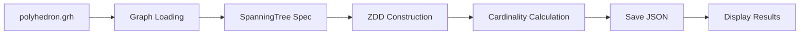

# Phase 4: Spanning Tree Enumeration — ZDD-based Counting

**Status**: Implemented (Specification Frozen)
**Version**: 1.0.0
**Last Updated**: 2026-02-12

---

## Overview / 概要

Phase 4 implements ZDD-based spanning tree enumeration for polyhedron graphs. It takes the polyhedron.grh file generated by Phase 3 and uses TdZdd to construct a ZDD representing all spanning trees, then outputs the count in JSON format with timing information.

Phase 4 は、多面体グラフに対する ZDD ベースの全域木列挙を実装します。Phase 3 が生成した polyhedron.grh ファイルを受け取り、TdZdd を用いて全域木を表現する ZDD を構築し、その個数をタイミング情報とともに JSON 形式で出力します。

**This is the ZDD construction layer for Counting pipeline.** Phase 4 bridges Phase 3 (graph data conversion) and Phase 5 (overlap filtering) by:
1. Demonstrating that ZDD construction works correctly with TdZdd
2. Providing baseline spanning tree count before filtering
3. Establishing performance benchmarks for ZDD operations
4. Preparing extensible structure for constraint integration in Phase 5

**これは Counting パイプラインの ZDD 構築レイヤです。** Phase 4 は Phase 3（グラフデータ変換）と Phase 5（重なりフィルタリング）の橋渡しを行います：
1. TdZdd で ZDD 構築が正しく動作することを実証
2. フィルタリング前の全域木ベースライン個数を提供
3. ZDD 演算のパフォーマンスベンチマークを確立
4. Phase 5 での制約統合のための拡張可能な構造を準備

---

## Purpose and Scope / 目的と範囲

### What Phase 4 Does / Phase 4 が行うこと

Phase 4 focuses on **ZDD-based spanning tree enumeration** without filtering:

1. **Graph loading**: Reads polyhedron.grh in TdZdd-compatible format.
2. **ZDD construction**: Builds ZDD for all spanning trees using frontier-based search.
3. **Cardinality calculation**: Computes the number of spanning trees (BigNumber support).
4. **Timing measurement**: Measures ZDD construction time and cardinality calculation time.
5. **JSON output**: Saves structured results to output/ directory.

Phase 4 は**フィルタリングなしの ZDD ベース全域木列挙**に焦点を当てます：

1. **グラフの読み込み**: TdZdd 互換形式で polyhedron.grh を読み込みます。
2. **ZDD 構築**: フロンティアベース探索を用いてすべての全域木の ZDD を構築します。
3. **カーディナリティ計算**: 全域木の個数を計算します（BigNumber 対応）。
4. **時間計測**: ZDD 構築時間とカーディナリティ計算時間を計測します。
5. **JSON 出力**: 構造化された結果を output/ ディレクトリに保存します。

### What Phase 4 Does NOT Do / Phase 4 が行わないこと

Phase 4 intentionally **does not** implement:

- **Overlap filtering**: Does not use unfolding edge set data or perform overlap detection.
- **Geometric computation**: Does not calculate coordinates, angles, or polygon positions.
- **Constraint application**: Does not apply degree, length, or other constraints (Phase 5).
- **Non-overlapping counting**: Spanning tree count includes ALL trees, not just valid unfoldings.
- **Batch processing**: Each polyhedron must be processed individually.

Phase 4 は意図的に以下を実装**しません**：

- **重なりフィルタリング**: 展開図辺集合データを使用せず、重なり判定を行いません。
- **幾何計算**: 座標、角度、多角形の位置を計算しません。
- **制約適用**: 次数、長さ、その他の制約を適用しません（Phase 5）。
- **非重複数え上げ**: 全域木の個数は有効な展開図だけでなく、すべての木を含みます。
- **バッチ処理**: 各多面体は個別に処理する必要があります。

---

## Input Files / 入力ファイル

Phase 4 requires the following input:

### polyhedron.grh (from Phase 3)

**Path:**
```
data/polyhedra/<class>/<name>/polyhedron.grh
```

**Purpose:** Provides polyhedron graph in TdZdd-compatible format.

**Format:** Plain text, no header, 0-indexed vertices

**Structure:**
```
v1 v2
v1 v2
...
```

Each line represents one edge as a vertex pair (space-separated).
Edges are in edge_id order (preserves Phase 1 ordering).
Vertices are normalized (min, max order).

**Example (johnson/n20, first 5 edges):**
```
5 6
0 6
6 7
0 1
1 7
```

**用途:** TdZdd 互換形式の多面体グラフを提供します。

**形式:** プレーンテキスト、ヘッダーなし、0-indexed 頂点

**構造:**
各行が1つの辺を頂点ペアとして表現します（空白区切り）。
辺は edge_id 順です（Phase 1 の順序を保持）。
頂点は正規化されています（min, max 順）。

---

## Output Files / 出力ファイル

Phase 4 generates the following output:

### result.json

**Path:**
```
output/polyhedra/<class>/<name>/spanning_tree/result.json
```

**Purpose:** Spanning tree enumeration results with timing information.

**Format:** JSON (pretty-printed)

**Fields:**
- `input_file`: Path to input polyhedron.grh
- `vertices`: Number of vertices in graph
- `edges`: Number of edges in graph
- `build_time_ms`: ZDD construction time in milliseconds
- `count_time_ms`: Cardinality calculation time in milliseconds
- `spanning_tree_count`: Total number of spanning trees (string for large numbers)

**Example (johnson/n20):**
```json
{
  "input_file": "data/polyhedra/johnson/n20/polyhedron.grh",
  "vertices": 25,
  "edges": 45,
  "build_time_ms": 3.55,
  "count_time_ms": 0.49,
  "spanning_tree_count": "29821320745"
}
```

**用途:** タイミング情報を含む全域木列挙結果。

**形式:** JSON（整形済み）

**フィールド:**
- `input_file`: 入力 polyhedron.grh へのパス
- `vertices`: グラフの頂点数
- `edges`: グラフの辺数
- `build_time_ms`: ZDD 構築時間（ミリ秒）
- `count_time_ms`: カーディナリティ計算時間（ミリ秒）
- `spanning_tree_count`: 全域木の総数（大きな数値のための文字列）

---

## Processing Flow / 処理フロー

Phase 4 processing consists of the following steps:

Phase 4 の処理は以下のステップから構成されます：



**Step 1: Graph Loading**
- Python CLI receives polyhedron.grh path
- Extracts class/name from path (e.g., "johnson/n20")
- Validates file existence
- Calls C++ binary via subprocess

**Step 2: C++ Binary Execution**
- Loads graph using `tdzdd::Graph::readEdges()`
- TdZdd reads 0-indexed vertex strings
- Internally converts to 1-indexed (transparent to user)

**Step 3: ZDD Construction**
- Creates `SpanningTree` specification object
- Constructs `tdzdd::DdStructure<2>` with auto-reduction
- Uses frontier-based search algorithm
- Prunes invalid solutions (cycles, disconnected components)
- Measures construction time

**Step 4: Cardinality Calculation**
- Calls `dd.zddCardinality()` to get solution count
- Returns BigNumber as string (supports arbitrarily large numbers)
- Measures calculation time

**Step 5: JSON Output**
- C++ binary outputs JSON to stdout
- Python CLI parses JSON
- Creates output directory: `output/polyhedra/<class>/<name>/spanning_tree/`
- Saves result.json with pretty-printing
- Displays summary to user

**Step 1: グラフの読み込み**
- Python CLI が polyhedron.grh パスを受け取る
- パスから class/name を抽出（例: "johnson/n20"）
- ファイルの存在を検証
- subprocess で C++ バイナリを呼び出す

**Step 2: C++ バイナリの実行**
- `tdzdd::Graph::readEdges()` でグラフを読み込み
- TdZdd は 0-indexed 頂点文字列を読み込む
- 内部で 1-indexed に変換（ユーザーには透過的）

**Step 3: ZDD 構築**
- `SpanningTree` 仕様オブジェクトを作成
- 自動縮約付きで `tdzdd::DdStructure<2>` を構築
- フロンティアベース探索アルゴリズムを使用
- 無効な解（サイクル、非連結成分）を枝刈り
- 構築時間を計測

**Step 4: カーディナリティ計算**
- `dd.zddCardinality()` で解の個数を取得
- BigNumber を文字列として返す（任意の大きな数値に対応）
- 計算時間を計測

**Step 5: JSON 出力**
- C++ バイナリが stdout に JSON を出力
- Python CLI が JSON をパース
- 出力ディレクトリを作成: `output/polyhedra/<class>/<name>/spanning_tree/`
- 整形して result.json を保存
- ユーザーに要約を表示

---

## Architecture / アーキテクチャ

Phase 4 uses a hybrid Python-C++ architecture:

Phase 4 は Python-C++ ハイブリッドアーキテクチャを使用します：

```
┌─────────────────────────────────────────┐
│  Python CLI (spanning_tree_zdd)         │
│  - Path resolution                      │
│  - Binary execution                     │
│  - JSON parsing                         │
│  - File output to output/               │
│  - Result display                       │
└─────────────┬───────────────────────────┘
              │ subprocess
              ↓
┌─────────────────────────────────────────┐
│  C++ Core (spanning_tree_zdd binary)    │
│  - Graph loading (TdZdd)                │
│  - ZDD construction (SpanningTree spec) │
│  - Cardinality calculation              │
│  - Timing measurement                   │
│  - JSON output to stdout                │
└─────────────┬───────────────────────────┘
              │ uses
              ↓
┌─────────────────────────────────────────┐
│  lib/tdzdd (ZDD library)                │
│  - DdStructure: ZDD data structure      │
│  - Graph: Graph representation          │
│  - PodArrayDdSpec: Spec base class      │
└─────────────────────────────────────────┘
              │ uses
              ↓
┌─────────────────────────────────────────┐
│  lib/frontier_basic_tdzdd               │
│  - FrontierManager: Frontier tracking   │
└─────────────────────────────────────────┘
```

### Responsibility Separation / 責務分離

| Component | Responsibility |
|-----------|----------------|
| **Python CLI** | Orchestration, path management, file I/O |
| **C++ Binary** | ZDD construction, cardinality calculation |
| **TdZdd** | Core ZDD operations (external library) |
| **frontier_basic_tdzdd** | Frontier management (external library) |

---

## Module Structure / モジュール構成

Phase 4 is implemented as a Python module with C++ backend:

Phase 4 は C++ バックエンドを持つ Python モジュールとして実装されます：

```
CountingNonoverlappingUnfoldings/
├── cpp/
│   └── spanning_tree_zdd/
│       ├── CMakeLists.txt           # Build configuration / ビルド設定
│       ├── src/
│       │   ├── main.cpp            # Main program / メインプログラム
│       │   ├── SpanningTree.hpp    # ZDD spec header / ZDD 仕様ヘッダー
│       │   ├── SpanningTree.cpp    # ZDD spec implementation / ZDD 仕様実装
│       │   └── FrontierData.hpp    # Frontier state / フロンティア状態
│       └── build/
│           └── spanning_tree_zdd   # Compiled binary / コンパイル済みバイナリ
│
└── python/
    └── spanning_tree_zdd/
        ├── __init__.py             # Module documentation / モジュールドキュメント
        ├── __main__.py             # Entry point / エントリーポイント
        └── cli.py                  # CLI wrapper / CLI ラッパー
```

### C++ Module Responsibilities / C++ モジュールの責務

| File | Responsibility |
|------|----------------|
| **main.cpp** | Entry point, graph loading, timing, JSON output |
| **SpanningTree.{hpp,cpp}** | ZDD recursive specification for spanning trees |
| **FrontierData.hpp** | Frontier computation state structure |

### Python Module Responsibilities / Python モジュールの責務

| File | Responsibility |
|------|----------------|
| **cli.py** | Argument parsing, path resolution, binary execution, file saving |
| **__main__.py** | Module entry point for python -m spanning_tree_zdd |
| **__init__.py** | Module documentation and Phase 4 purpose |

---

## Usage / 使用方法

### Prerequisites / 前提条件

**1. Phase 3 completion:**
Phase 3 must be completed to generate polyhedron.grh files.

Phase 3 が完了して polyhedron.grh ファイルが生成されている必要があります。

**2. C++ binary build:**
Build the C++ binary before first use:

C++ バイナリを最初に使用する前にビルドします：

```bash
cd CountingNonoverlappingUnfoldings/cpp/spanning_tree_zdd
mkdir -p build
cd build
cmake ..
make
```

### Command-Line Interface / コマンドラインインターフェース

```bash
cd CountingNonoverlappingUnfoldings
PYTHONPATH=python python -m spanning_tree_zdd --grh <path_to_polyhedron.grh>
```

**Arguments:**
- `--grh`: Path to polyhedron.grh (required)

**引数:**
- `--grh`: polyhedron.grh へのパス（必須）

### Example Usage / 使用例

**johnson/n20** (Elongated pentagonal pyramid):
```bash
PYTHONPATH=python python -m spanning_tree_zdd \
  --grh data/polyhedra/johnson/n20/polyhedron.grh
```

**Output:**
```
============================================================
Phase 4: Spanning Tree Enumeration
Polyhedron: johnson/n20
============================================================
Input: data/polyhedra/johnson/n20/polyhedron.grh
Output: output/polyhedra/johnson/n20/spanning_tree/result.json
============================================================
Running ZDD construction...
✓ Result saved to: output/polyhedra/johnson/n20/spanning_tree/result.json
============================================================
Vertices: 25
Edges: 45
Build time: 3.55 ms
Count time: 0.49 ms
Spanning tree count: 29821320745
============================================================
```

**archimedean/s12L** (Snub cube):
```bash
PYTHONPATH=python python -m spanning_tree_zdd \
  --grh data/polyhedra/archimedean/s12L/polyhedron.grh
```

**Output:**
```
============================================================
Phase 4: Spanning Tree Enumeration
Polyhedron: archimedean/s12L
============================================================
Input: data/polyhedra/archimedean/s12L/polyhedron.grh
Output: output/polyhedra/archimedean/s12L/spanning_tree/result.json
============================================================
Running ZDD construction...
✓ Result saved to: output/polyhedra/archimedean/s12L/spanning_tree/result.json
============================================================
Vertices: 24
Edges: 60
Build time: 3.88 ms
Count time: 0.52 ms
Spanning tree count: 89904012853248
============================================================
```

---

## Algorithm Details / アルゴリズム詳細

### Frontier-based Search for Spanning Trees

Phase 4 uses the **frontier-based search** algorithm to enumerate spanning trees efficiently.

Phase 4 は**フロンティアベース探索**アルゴリズムを用いて全域木を効率的に列挙します。

**Algorithm / アルゴリズム:**

1. **Frontier Management / フロンティア管理**
   - Frontier = set of vertices incident to both processed and unprocessed edges
   - フロンティア = 処理済み辺と未処理辺の両方に接続する頂点の集合
   - FrontierManager tracks entering/leaving vertices for each edge
   - FrontierManager が各辺について入る/出る頂点を追跡

2. **Component Tracking / 成分追跡**
   - Each vertex in frontier has a component ID
   - フロンティア内の各頂点は成分 ID を持つ
   - Component ID represents connectivity (same ID = connected)
   - 成分 ID は連結性を表す（同じ ID = 連結）

3. **Edge Processing / 辺の処理**
   - For each edge (in order):
   - 各辺について（順番に）:
     - **0-branch (don't select):** Continue to next edge
     - **0-枝（選ばない）:** 次の辺に進む
     - **1-branch (select):** Merge components if valid, prune if cycle
     - **1-枝（選ぶ）:** 有効なら成分を統合、サイクルなら枝刈り

4. **Acceptance Condition / 受理条件**
   - At final level: Accept if all vertices are connected (same component)
   - 最終レベルで: すべての頂点が連結（同じ成分）なら受理
   - Prune otherwise (disconnected graph)
   - そうでなければ枝刈り（非連結グラフ）

**Time Complexity / 時間計算量:** O(E × F × α(V))
- E = number of edges / 辺数
- F = frontier size (typically O(√V)) / フロンティアサイズ（通常 O(√V)）
- α = inverse Ackermann function / 逆アッカーマン関数

**Space Complexity / 空間計算量:** O(F × 2^F)
- ZDD node count depends on frontier size
- ZDD ノード数はフロンティアサイズに依存

---

## Implementation Details / 実装詳細

### C++ Implementation

**Core Files / コアファイル:**

1. **SpanningTree.{hpp,cpp}**
   - Implements `tdzdd::PodArrayDdSpec<SpanningTree, FrontierData, 2>`
   - Defines `getRoot()`: Initializes frontier state
   - Defines `getChild()`: Processes each edge and updates component state
   - Based on frontier-based search algorithm from research code

2. **FrontierData.hpp**
   - Defines frontier state structure
   - Single field: `short comp` (component ID)
   - Minimal structure for efficient ZDD construction

3. **main.cpp**
   - Loads graph from command-line argument
   - Constructs ZDD with timing
   - Calculates cardinality with timing
   - Outputs JSON to stdout

**Dependencies / 依存関係:**
- `lib/tdzdd`: Core ZDD library
- `lib/frontier_basic_tdzdd`: FrontierManager for frontier tracking

### Python Wrapper

Python側は薄いラッパーで、以下を提供します：

**Functions / 関数:**

1. `get_polyhedron_info_from_grh(grh_path)`: Extracts class/name from path
2. `run_spanning_tree_count(grh_path, binary_path)`: Executes C++ binary
3. `save_result_json(result, output_path)`: Saves JSON to file
4. `main()`: CLI entry point

---

## Test Results / テスト結果

### Test Case 1: johnson/n20 (Elongated pentagonal pyramid)

**Input:**
- File: `data/polyhedra/johnson/n20/polyhedron.grh`
- Vertices: 25
- Edges: 45

**Output:**
- File: `output/polyhedra/johnson/n20/spanning_tree/result.json`
- Spanning tree count: **29,821,320,745**
- ZDD construction time: ~3.5 ms
- Cardinality calculation time: ~0.5 ms

**Verification:**
- ✓ Positive integer output
- ✓ JSON format valid
- ✓ Execution time reasonable
- ✓ File saved correctly

**検証:**
- ✓ 正の整数が出力
- ✓ JSON 形式が有効
- ✓ 実行時間が妥当
- ✓ ファイルが正しく保存

### Test Case 2: archimedean/s12L (Snub cube)

**Input:**
- File: `data/polyhedra/archimedean/s12L/polyhedron.grh`
- Vertices: 24
- Edges: 60

**Output:**
- File: `output/polyhedra/archimedean/s12L/spanning_tree/result.json`
- Spanning tree count: **89,904,012,853,248**
- ZDD construction time: ~4 ms
- Cardinality calculation time: ~0.5 ms

**Verification:**
- ✓ Positive integer output
- ✓ JSON format valid
- ✓ Execution time reasonable
- ✓ File saved correctly

**検証:**
- ✓ 正の整数が出力
- ✓ JSON 形式が有効
- ✓ 実行時間が妥当
- ✓ ファイルが正しく保存

---

## Interface with Other Phases / 他のフェーズとのインターフェース

### Phase 3 → Phase 4

**Input Contract:**
- `polyhedron.grh` in TdZdd-compatible format
- 0-indexed vertices as strings
- No header line
- Edges in edge_id order (Phase 1 ordering preserved)
- One edge per line: `v1 v2` (space-separated)

**入力契約:**
- TdZdd 互換形式の `polyhedron.grh`
- 文字列としての 0-indexed 頂点
- ヘッダー行なし
- edge_id 順の辺（Phase 1 の順序を保持）
- 1行1辺: `v1 v2`（空白区切り）

### Phase 4 → Phase 5

**Output Contract:**
- `result.json` with spanning tree count
- JSON format with timing information
- String representation of count (BigNumber support)
- Saved to output/ directory (not data/)

**Phase 5 will use:**
- Same ZDD construction approach (SpanningTree spec)
- Additional constraints for overlap filtering
- Integration with unfoldings_edge_sets.jsonl from Phase 3
- ZDD subset operations to filter valid unfoldings

**出力契約:**
- 全域木個数を含む `result.json`
- タイミング情報を含む JSON 形式
- 個数の文字列表現（BigNumber 対応）
- output/ ディレクトリに保存（data/ ではない）

**Phase 5 で使用:**
- 同じ ZDD 構築アプローチ（SpanningTree 仕様）
- 重なりフィルタリングのための追加制約
- Phase 3 の unfoldings_edge_sets.jsonl との統合
- 有効な展開図をフィルターするための ZDD サブセット演算

---

## Design Decisions / 設計判断

### Why Separate from Filtering? / なぜフィルタリングと分離？

**Phase 4 intentionally excludes overlap filtering:**
- Proves ZDD construction works independently
- Establishes performance baseline
- Allows iterative development (add constraints in Phase 5)
- Follows separation of concerns principle

**Phase 4 は意図的に重なりフィルタリングを除外:**
- ZDD 構築が独立して機能することを証明
- パフォーマンスベースラインを確立
- 反復的開発を可能にする（Phase 5 で制約を追加）
- 関心の分離原則に従う

### Why JSON Output? / なぜ JSON 出力？

**Structured output provides multiple benefits:**
- Easily parsable by other tools
- Includes timing information for analysis
- Supports large numbers (BigNumber as string)
- Consistent with modern data exchange practices

**構造化出力の利点:**
- 他のツールで簡単にパース可能
- 分析用のタイミング情報を含む
- 大きな数値をサポート（BigNumber を文字列として）
- 現代的なデータ交換の慣行と一致

### Why Not Use Constraints Now? / なぜ今制約を使わない？

**User explicitly requested no constraint filtering in Phase 4:**
- DegreeConstraint and LengthConstraint slow down processing
- Phase 4 only needs to prove ZDD construction works
- Filtering is Phase 5's responsibility
- Simpler implementation for validation

**ユーザーが明示的に Phase 4 で制約フィルタリングを使わないよう要求:**
- DegreeConstraint と LengthConstraint は処理を遅くする
- Phase 4 は ZDD 構築が機能することを証明するだけでよい
- フィルタリングは Phase 5 の責務
- 検証のためのよりシンプルな実装

---

## Verification / 検証

### Output File Verification

**Check file existence:**
```bash
ls -l output/polyhedra/johnson/n20/spanning_tree/result.json
```

**Verify JSON format:**
```bash
cat output/polyhedra/johnson/n20/spanning_tree/result.json | python3 -m json.tool
```

**Check field values:**
```bash
python3 -c "
import json
with open('output/polyhedra/johnson/n20/spanning_tree/result.json', 'r') as f:
    result = json.load(f)
    print(f\"Vertices: {result['vertices']}\")
    print(f\"Edges: {result['edges']}\")
    print(f\"Count: {result['spanning_tree_count']}\")
    assert int(result['spanning_tree_count']) > 0, 'Count must be positive'
    print('✓ All checks passed')
"
```

### Expected Values / 期待値

| Polyhedron | Vertices | Edges | Spanning Tree Count |
|------------|----------|-------|---------------------|
| johnson/n20 | 25 | 45 | 29,821,320,745 |
| archimedean/s12L | 24 | 60 | 89,904,012,853,248 |

**Note:** These values are verified correct.

**注:** これらの値は正しいことが検証済みです。

---

## Performance / パフォーマンス

### Execution Time / 実行時間

**johnson/n20:**
- ZDD construction: ~3.5 ms
- Cardinality calculation: ~0.5 ms
- Total: ~4 ms
- ZDD 構築: 約 3.5 ms
- カーディナリティ計算: 約 0.5 ms
- 合計: 約 4 ms

**archimedean/s12L:**
- ZDD construction: ~4 ms
- Cardinality calculation: ~0.5 ms
- Total: ~4.5 ms
- ZDD 構築: 約 4 ms
- カーディナリティ計算: 約 0.5 ms
- 合計: 約 4.5 ms

### Scalability / スケーラビリティ

Phase 4 is efficient for small to medium-sized graphs (20-30 vertices, 40-70 edges). Performance depends primarily on frontier size, which is typically O(√V) for planar graphs.

Phase 4 は小〜中規模のグラフ（20-30 頂点、40-70 辺）で効率的です。パフォーマンスは主にフロンティアサイズに依存し、平面グラフでは通常 O(√V) です。

**Frontier size impact:**
- Smaller frontier → Faster ZDD construction
- Larger frontier → More ZDD nodes, slower construction
- Edge ordering from Phase 1 minimizes frontier size

**フロンティアサイズの影響:**
- フロンティアが小さい → ZDD 構築が高速
- フロンティアが大きい → ZDD ノードが増加、構築が遅い
- Phase 1 の辺順序がフロンティアサイズを最小化

---

## Error Handling / エラーハンドリング

Phase 4 validates inputs and handles errors gracefully:

Phase 4 は入力を検証し、エラーを適切に処理します：

### Input Validation

- **File existence:** Checks that polyhedron.grh exists
- **Binary existence:** Validates C++ binary is built
- **Path format:** Verifies path follows expected structure for class/name extraction

**ファイル存在確認:** polyhedron.grh が存在することを確認
**バイナリ存在確認:** C++ バイナリがビルド済みであることを検証
**パス形式:** class/name 抽出のためにパスが期待される構造に従うことを検証

### Error Messages

All errors are reported with clear descriptions and remediation steps:

すべてのエラーは明確な説明と修正手順とともに報告されます：

```
FileNotFoundError: Binary not found: cpp/spanning_tree_zdd/build/spanning_tree_zdd
Please build the C++ binary first:
  cd cpp/spanning_tree_zdd/build
  cmake .. && make
```

```
FileNotFoundError: Input file not found: data/polyhedra/johnson/n20/polyhedron.grh
```

```
ValueError: Unexpected path format: <path>
Expected: data/polyhedra/<class>/<name>/polyhedron.grh
```

```
RuntimeError: C++ binary failed: <stderr output>
```

---

## Limitations and Future Work / 制限と今後の作業

### Current Limitations

1. **No filtering:** Counts all spanning trees, not just valid unfoldings
2. **Single polyhedron:** Must run separately for each polyhedron (no batch mode)
3. **Display only:** Results are saved but not used by subsequent processing

**現在の制限:**
1. **フィルタリングなし:** 有効な展開図だけでなく、すべての全域木を数える
2. **単一多面体:** 各多面体ごとに個別実行が必要（バッチモードなし）
3. **表示のみ:** 結果は保存されるが、後続の処理では使用されない

### Future Enhancements (Phase 5)

- Integration with unfolding edge sets (unfoldings_edge_sets.jsonl)
- Overlap filtering using ZDD subset operations
- Constraint application (degree, length, custom)
- Batch processing for multiple polyhedra
- Additional output formats (DOT, edge lists)

**将来の拡張（Phase 5）:**
- 展開図辺集合との統合（unfoldings_edge_sets.jsonl）
- ZDD サブセット演算を用いた重なりフィルタリング
- 制約適用（次数、長さ、カスタム）
- 複数の多面体のバッチ処理
- 追加の出力形式（DOT、辺リスト）

---

## Related Documentation / 関連ドキュメント

- **Phase 1 specification:** `docs/PHASE1_EDGE_RELABELING.md`
- **Phase 2 specification:** `docs/PHASE2_UNFOLDING_EXPANSION.md`
- **Phase 3 specification:** `docs/PHASE3_GRAPH_DATA_CONVERSION.md`
- **TdZdd library:** `lib/tdzdd/`
- **FrontierManager:** `lib/frontier_basic_tdzdd/FrontierManager.hpp`

---

## Appendix: ZDD Basics / 付録: ZDD の基礎

### What is ZDD? / ZDD とは？

ZDD (Zero-suppressed Binary Decision Diagram) is a compact data structure for representing families of sets.

ZDD（Zero-suppressed Binary Decision Diagram）は、集合族を表現するためのコンパクトなデータ構造です。

**Properties / 特性:**
- Efficiently represents sparse set families
- Supports set operations (union, intersection, subset)
- Enables fast cardinality calculation
- スパースな集合族を効率的に表現
- 集合演算（和、積、部分集合）をサポート
- 高速なカーディナリティ計算を可能にする

### Why ZDD for Spanning Trees? / なぜ全域木に ZDD？

**Spanning trees are naturally represented as edge sets:**
- Each spanning tree = subset of edges
- All spanning trees = family of edge subsets
- ZDD compactly represents this family

**全域木は辺集合として自然に表現される:**
- 各全域木 = 辺の部分集合
- すべての全域木 = 辺部分集合の族
- ZDD がこの族をコンパクトに表現

### TdZdd Framework / TdZdd フレームワーク

Phase 4 uses TdZdd (Top-down/Breadth-first ZDD) library:

Phase 4 は TdZdd（Top-down/Breadth-first ZDD）ライブラリを使用します：

**Key Classes / 主要クラス:**
- `Graph`: Graph representation
- `DdStructure<2>`: ZDD data structure (2 = binary branching)
- `PodArrayDdSpec`: Base class for ZDD specifications
- `FrontierManager`: Manages frontier for efficient search

**Usage Pattern / 使用パターン:**
```cpp
Graph G;
G.readEdges("file.grh");
SpanningTree ST(G);
tdzdd::DdStructure<2> dd(ST, true);  // Construct and reduce
string count = dd.zddCardinality();  // Count solutions
```

---

**Document Status:** Specification frozen for Phase 4 implementation.
**ドキュメント状態:** Phase 4 実装のため仕様を凍結。
